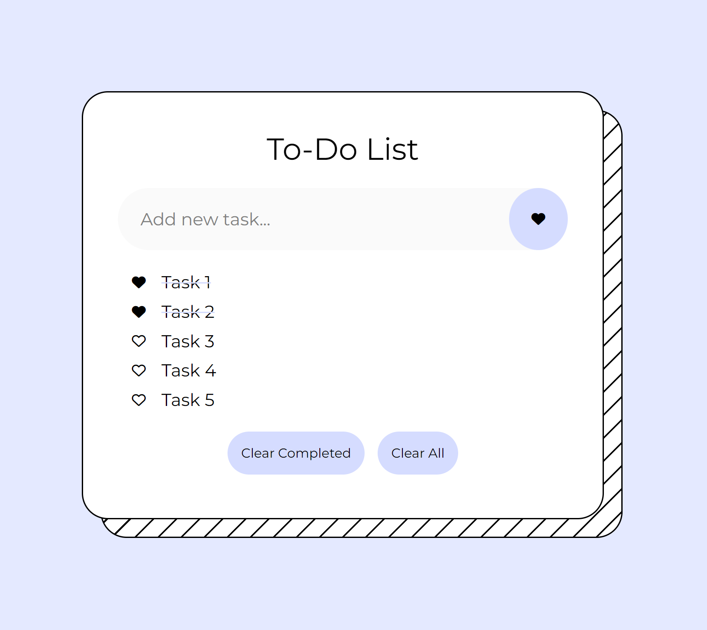

# To-Do List

### Description
- This to-do list allows users to:
  - Add new tasks (users are prevented from adding empty tasks)
  - Mark completed tasks
  - Clear completed tasks
  - Clear all tasks
- Data is saved to the local browser storage, so users can refresh or close the browser, reopen the to-do list, and still have the same information available.

### Tech Used
- HTML
- CSS
- JavaScript

### Lessons Learned
- How to style pseudo-elements in CSS
- How to create new elements in JS
- How to save data to the local browser storage

### Notes
I did this project as part of a bootcamp assignment. I took the chance to design my dream to-do list, and I love how it came out!! I use it everyday now. ❤